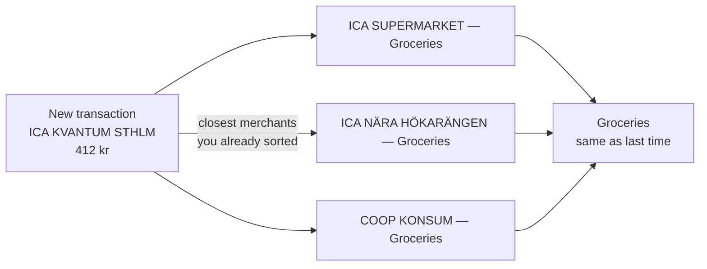
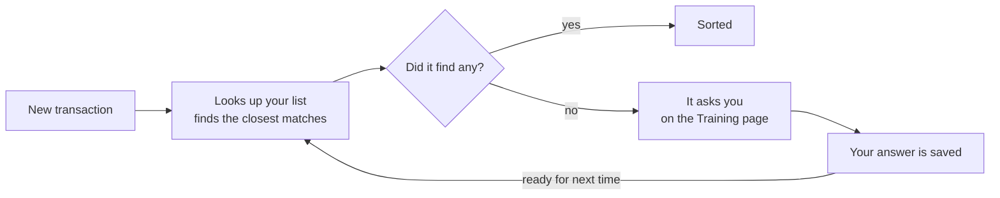
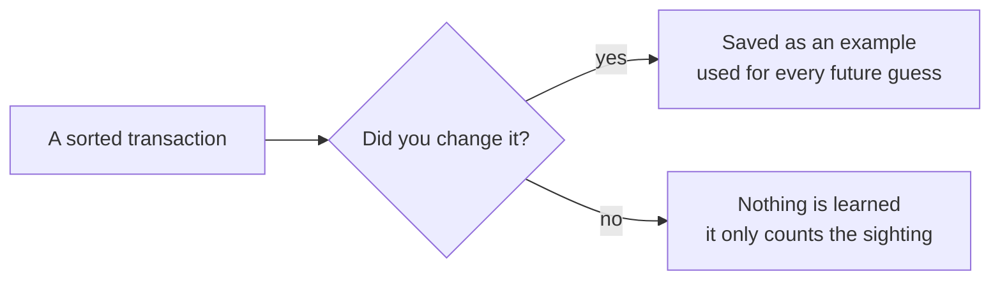
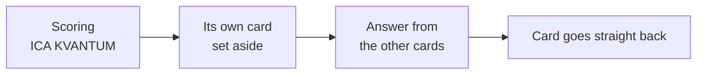

# How the categorizer works

Your bank says you spent 412 kr at `ICA KVANTUM STHLM`. Pegels turns that into **Groceries**. This
is how — and how it gets better every time you correct it.

No AI model is ever trained. Everything the categorizer knows is a list of merchants in your own
database that you can read, edit, or delete.

---

## Step one: it looks up what you did last time

Pegels keeps a list of every merchant you have already sorted. When a new transaction arrives, it
finds the entries that look most like it and shows those to the AI as worked examples.

**It is not general knowledge about shops — it is your history.** If you file a particular café
under Coffee and someone else files theirs under Eating out, both are right, and each instance
follows its own owner.

Two lookups actually run side by side: one on meaning and one on plain spelling. A merchant both
agree on wins. Keeping them independent means a dead embeddings API degrades quality instead of
breaking categorization outright.

## Step two: when it doesn't know, it says so

Pegels never asks the AI how sure it feels. It checks something more reliable: did the lookup
actually find anything?

| Level | What it means |
|---|---|
| **Confident** | It found this exact merchant, and the answer matches what you filed it under before. |
| **Reasonable** | It found something related, but nothing that settles it. |
| **No idea** | It has never seen this merchant. This one comes to you. |

This is why the UI shows words instead of a percentage. A number like "87% sure" would be made up —
an AI's own sense of certainty is unreliable, and measured on this app's own data its mean on
correct answers (0.58) and on wrong ones (0.53) are indistinguishable. The score is kept internally
and never shown.

## Step three: your answer becomes the next lookup

Anything the app couldn't settle waits for you at `/training`. You pick the right category, and that
merchant joins the list — so the same question never comes back.

**It is a circle, not a production line.** The merchants it is worst at are exactly the ones it
hands to you — and those are the ones that teach it the most. A month or two in, it is asking about
almost nothing.

## The one rule: it is not allowed to teach itself

Only categories *you* touched go on the list. When the AI sorts a merchant and you leave it alone,
nothing is learned from that — the app just notes it saw the merchant again.

**Otherwise it would end up confirming its own mistakes.** A system that treats its own guesses as
proof drifts further from the truth the longer it runs, and sounds more confident the whole way.

That split is what the Training page is showing you:

| State | Meaning |
|---|---|
| **Approved** | You said yes. Used for every future guess. |
| **Awaiting review** | Seen but not confirmed. Counted, not used. One click promotes it. |

One escape hatch, for the cold start: below 50 approved merchants, unconfirmed ones are allowed into
the prompt too, under a separate and explicitly weaker heading. An empty list that retrieves nothing
would otherwise never get off the ground.

## Keeping it honest: a quiz it can't study for

Think of the list as flashcards. Each card says "this shop, this category", and the AI gets to peek
at the closest cards before answering.

To test it fairly, a card is taken off the table **while that card is the question** — then put
straight back. It has to work the shop out from everything else it knows instead of reading the
answer off its own card. Nothing is hidden from your actual transactions, not for a moment.

**That used to cost something.** An earlier version reserved a fifth of the list permanently, so
every merchant that made the measurement better made your categorization worse. Setting a card aside
only for its own question buys the same honest number and charges nothing for it.

The check runs from the Training page, over a sample of about sixty confirmed places, and answers
three separate questions:

| Number | What it asks |
|---|---|
| **Places it knows** | Of the transactions you actually have, how many come from a shop already on the list? |
| **…it gets right** | When it *has* seen the shop, does it agree with you? Should be high — if not, it is ignoring evidence it was handed. |
| **New places** | With the card set aside, can it still work it out? This is the one that climbs as the list grows. |

The headline figure blends the three by how often each case really happens, so it describes your
ledger rather than a test set. Both scores run the real categorization path, not a parallel copy of
it that could quietly drift.

The same places are picked every run (by hashing each row's id, not at random). If the sample
changed between runs, a better score might just mean an easier quiz.

Every disagreement is kept rather than counted and thrown away. Two near-synonymous categories
trading places over and over is a problem with your category list, and no amount of examples will
fix it.

---

## The proper names for all this

None of the ideas above are homemade. Each step has a name people in the field use.

| Term | Where it lands |
|---|---|
| **Retrieval-augmented generation (RAG)** | Step one. Looking things up and handing the AI what you found, instead of trusting it to remember. |
| **Embeddings** | How "similar" is measured. Every merchant name becomes a position in space, arranged so names meaning similar things land near each other. |
| **Hybrid search** | The two lookups running side by side — meaning and spelling — merged by rank. |
| **Few-shot prompting** | Showing the AI a handful of solved examples rather than writing out rules. |
| **Human in the loop** | Routing the least certain cases to a person and treating that answer as truth. Also what stops the AI grading its own homework. |
| **Leave-one-out cross-validation** | Testing on a card by hiding only that card. An honest score without setting any data aside permanently. |

One term you will **not** find here is fine-tuning. No model is trained or changed at any point — it
stays exactly as it shipped, and everything it appears to learn is the list of examples it gets
shown. That is the whole reason a mistake is one edit away instead of a retraining job.

## Where this lives in the code

| Piece | File |
|---|---|
| The hybrid lookup | `src/lib/ai/retrieve.ts` |
| Merging the two searches | `src/lib/ai/fuse.ts` |
| The three confidence levels | `src/lib/ai/confidence.ts` |
| Choosing which places get scored | `src/lib/ai/hash.ts` |
| The approved / candidate gate | `src/lib/corpus/record.ts` |
| Setting a place's own card aside | `src/lib/ai/retrieve.ts` |
| Scoring, and the confusion pairs | `src/lib/eval/score.ts` |
| How much of your ledger it knows | `src/lib/eval/coverage.ts` |
| Running a check | `src/app/actions/accuracy.ts` |
| The Training page | `src/app/(app)/training/page.tsx` |
